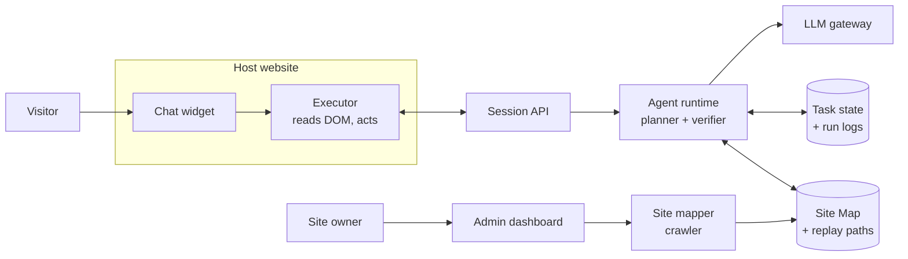
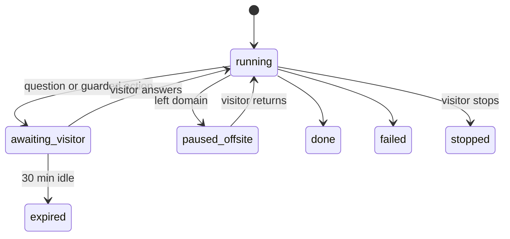

# Site Copilot — Software Requirements Specification

2026-09-19 · @Someone

## 1. Introduction

Site Copilot (working name) turns any website into one with a built-in AI copilot that operates the site for the visitor, installed with a single script tag.

### 1.1 Purpose

This SRS defines the requirements for v1: an embeddable agent that takes a visitor's instruction in chat and completes it by navigating and operating the website's own UI, inside the visitor's logged-in session.

### 1.2 Product summary

- A site owner adds one `<script>` tag. A chat widget appears on every page.
- A mapper crawls the site and builds a Site Map of pages, forms and actions. The owner reviews and approves it.
- A visitor types a goal ("book a truck to Mombasa on Friday"). The agent reads the page DOM, plans steps, clicks, types and navigates across pages, and confirms before risky actions.
- Successful runs are saved as replayable paths, so repeat tasks run faster and cheaper.

### 1.3 Assumptions (stated, to be confirmed)

1. The buyer is the site owner, not the end user. The copilot is first-party on their domain.
2. The agent acts through the UI (DOM), not the site's APIs or source code. Code or API access is a later enhancement.
3. The agent never handles passwords. It only acts inside a session the visitor already has.
4. v1 supports both single-page apps and classic multi-page sites, using server-side task state to survive reloads.
5. v1 works only on the owner's own domain(s). Off-domain steps (payment gateways, external logins) are handed back to the visitor.

### 1.4 Definitions

| Term | Meaning |
| --- | --- |
| Site owner | Business that installs the copilot on its website |
| Visitor | Person using the website and talking to the copilot |
| Site Map | Owner-approved catalogue of pages, forms and actions |
| Task | One visitor goal, from instruction to verified outcome |
| Step | One UI action: click, type, select, navigate, wait, verify |
| Replay path | Recorded step sequence from a successful task, reused for similar tasks |
| Guarded action | Action marked as risky (pay, delete, submit) that needs visitor confirmation |

## 2. Overall description

Three actors use the system: the site owner configures it, the visitor uses it, and the platform operator runs it.

### 2.1 Actors

| Actor | Goals | Main interactions |
| --- | --- | --- |
| Site owner (admin) | Add a copilot without engineering work; stay in control of what it can do | Install script, run mapper, approve Site Map, set guarded actions, view analytics and run logs |
| Visitor | Get tasks done by describing them | Chat, watch the agent act, confirm guarded actions, stop or take over at any time |
| Platform operator (us) | Run the service reliably and cheaply | Monitor runs, manage model costs, handle support |

### 2.2 Operating environment

- Runs in current desktop and mobile browsers (Chrome, Edge, Safari, Firefox; latest two versions).
- Host sites: SPAs (React, Next.js, Vue, Angular) and multi-page sites (WordPress, PHP, server-rendered).
- Backend: hosted cloud service with an LLM provider behind a model gateway.

### 2.3 Constraints

- The script only reaches the host page's same-origin DOM. Cross-origin iframes (payment widgets, embedded maps) cannot be operated.
- Some sites set a Content Security Policy that blocks third-party scripts or connections. The owner must allow the script and API domains.
- Each agent step costs a model call, so cost per task must be tracked and bounded.
- CAPTCHAs and bot checks are never solved or bypassed by the agent. They are handed to the visitor.

## 3. System architecture

A thin client in the browser executes steps, and all planning and task state live on the server, so a task survives page reloads, new tabs and crashes.

The executor sends a compact snapshot of the page to the agent runtime, receives one step, performs it, and reports the result.

### 3.1 Components

| Component | Runs in | Responsibility |
| --- | --- | --- |
| Embed script | Browser | Loads widget and executor; identifies site; resumes active task on each page load |
| Chat widget | Browser | Conversation UI, step highlights, confirm and stop controls |
| Executor | Browser | Builds DOM snapshots; performs click, type, select, scroll, navigate, wait; reports results |
| Session API | Server | Authenticates site key and visitor session; relays snapshots and steps |
| Agent runtime | Server | Plans next step from goal, Site Map, snapshot and history; verifies outcomes; applies guardrails |
| LLM gateway | Server | Model routing, retries, token and cost metering |
| Site mapper | Server | Crawls site (public and owner-authenticated), extracts pages, forms, fields and actions |
| Replay engine | Server | Matches tasks to saved paths; replays deterministically; falls back to the planner on mismatch |
| Admin dashboard | Web app | Install, Site Map review, guarded actions, analytics, run logs |
| Stores | Server | Task state, run logs, Site Maps, replay paths |

### 3.2 Task loop

1. Visitor sends a goal. The server creates a task.
2. Executor sends a DOM snapshot: visible interactive elements with labels, roles and stable selectors.
3. Agent returns one step, or asks the visitor a question.
4. Executor performs the step, waits for the page to settle, and reports the new snapshot.
5. Agent verifies the outcome and continues until the goal is met, a guarded action needs confirmation, or the task fails.
6. On navigation, the next page's script resumes the task from server state.

### 3.3 Page understanding

The agent works from DOM snapshots, not screenshots, for speed and cost. Screenshots are a fallback only for elements the DOM cannot describe (canvas, icon-only buttons).

## 4. Functional requirements

Priority: **M** = must have for v1, **S** = should have, **C** = could have later.

### 4.1 Installation and onboarding

| ID | Requirement | Priority |
| --- | --- | --- |
| FR-1 | Owner signs up and gets a site key and a one-line script tag. | M |
| FR-2 | Owner verifies domain ownership (DNS TXT record or meta tag) before the copilot can run. | M |
| FR-3 | Script loads asynchronously and must not block or break the host page if our service is down. | M |
| FR-4 | Owner can restrict the copilot to listed domains and URL paths. | M |
| FR-5 | Owner can theme the widget (colour, position, name, greeting). | S |

### 4.2 Site mapping

| ID | Requirement | Priority |
| --- | --- | --- |
| FR-6 | Mapper crawls public pages and, with an owner-provided test account, logged-in pages. | M |
| FR-7 | For each page, mapper records URL pattern, purpose, forms, fields (label, type, required, options) and actions (buttons, links). | M |
| FR-8 | Mapper proposes guarded actions automatically (submit payment, delete, cancel, send). | M |
| FR-9 | Owner reviews the Site Map: edit descriptions, disable pages or actions, mark or unmark guarded actions. | M |
| FR-10 | Only an approved Site Map is used in production. Re-mapping creates a new version for review. | M |
| FR-11 | Mapper also learns from live runs, proposing new pages or actions for owner approval. | C |

### 4.3 Chat and visitor control

| ID | Requirement | Priority |
| --- | --- | --- |
| FR-12 | Visitor can type a goal in natural language, in English at minimum. | M |
| FR-13 | Agent shows a short plan before acting and narrates each step in one line. | M |
| FR-14 | Agent highlights the element it is about to act on. | M |
| FR-15 | Visitor can stop the task at any time; the agent halts before the next step. | M |
| FR-16 | Visitor can take over manually and then ask the agent to continue. | S |
| FR-17 | Agent asks the visitor for missing information instead of guessing (e.g. which date). | M |
| FR-18 | Agent answers questions about the site from the Site Map without acting. | S |
| FR-19 | Support for additional languages (Swahili, Luganda, French). | C |

### 4.4 Task execution

| ID | Requirement | Priority |
| --- | --- | --- |
| FR-20 | Executor supports click, type, select, check, scroll, navigate, wait-for-element, read-text. | M |
| FR-21 | Executor handles native inputs and common custom components (custom dropdowns, date pickers, comboboxes). | M |
| FR-22 | After every step, agent verifies the expected result (element appeared, URL changed, message shown). | M |
| FR-23 | Failed steps retry with a different strategy up to 2 times, then the agent explains and hands control to the visitor. | M |
| FR-24 | Agent carries data between pages (read a value on page A, use it on page B). | M |
| FR-25 | Agent never fills password, card-number or OTP fields; it asks the visitor to fill them. | M |
| FR-26 | Agent operates only inside the owner's allowed domains and never navigates elsewhere on its own. | M |

### 4.5 Navigation and context

| ID | Requirement | Priority |
| --- | --- | --- |
| FR-27 | Task state (goal, plan, step index, collected data, chat history) is stored server-side, keyed by task and visitor session. | M |
| FR-28 | On every page load, the script checks for an active task, restores the chat and resumes the next step. | M |
| FR-29 | In SPAs, executor detects route changes and waits for new content before continuing. | M |
| FR-30 | When a flow leaves the domain, agent pauses with a message and resumes when the visitor returns. | M |
| FR-31 | A task stays bound to the tab it started in; other tabs show it as running elsewhere. | S |
| FR-32 | Idle tasks expire after 30 minutes. | M |

### 4.6 Guardrails

| ID | Requirement | Priority |
| --- | --- | --- |
| FR-33 | Guarded actions require explicit visitor confirmation showing exactly what will be submitted. | M |
| FR-34 | Agent acts only with the visitor's own session and cannot exceed their permissions. | M |
| FR-35 | Owner can set a maximum number of steps and maximum cost per task. | M |
| FR-36 | Instructions found in page content are treated as data, never as commands to the agent. | M |
| FR-37 | Agent refuses tasks outside the site's purpose (as defined by the owner). | S |

### 4.7 Record and replay

| ID | Requirement | Priority |
| --- | --- | --- |
| FR-38 | Every successful task is saved as a parameterised path (steps with variable inputs). | S |
| FR-39 | New tasks matching a saved path replay it without planner calls, verifying each step. | S |
| FR-40 | On any mismatch during replay, the planner takes over from the current step. | S |
| FR-41 | Owner can view, rename, disable or delete replay paths. | C |

### 4.8 Admin dashboard

| ID | Requirement | Priority |
| --- | --- | --- |
| FR-42 | Run log per task: goal, steps, snapshots summary, outcome, cost, duration. | M |
| FR-43 | Analytics: tasks started, completed, failed, handed over; top goals; top failure points. | M |
| FR-44 | Usage and cost by day, with a monthly spend cap. | M |
| FR-45 | Team access with owner and viewer roles. | S |

## 5. Non-functional requirements

The targets below are initial proposals for v1 and should be tuned after the first pilot.

| ID | Area | Requirement |
| --- | --- | --- |
| NFR-1 | Page impact | Embed script under 50 KB gzipped; loads async; adds no more than 100 ms to page interactive time. |
| NFR-2 | Step latency | Median time per planned step under 3 s; replayed steps under 1 s. |
| NFR-3 | Task success | At least 85% of tasks on the approved Site Map complete without handover on pilot sites. |
| NFR-4 | Availability | Backend 99.5% monthly; if unavailable, the widget hides and the site works normally. |
| NFR-5 | Isolation | Widget renders in a shadow DOM so host CSS and our CSS never affect each other. |
| NFR-6 | Security | All traffic over TLS; site keys scoped to verified domains; per-site and per-visitor rate limits. |
| NFR-7 | Privacy | DOM snapshots mask password, card, OTP and owner-marked sensitive fields before leaving the browser. |
| NFR-8 | Data retention | Run logs kept 30 days by default, configurable by owner; snapshots stored only in redacted form. |
| NFR-9 | Compliance | Data processing terms for owners; alignment with Uganda's Data Protection and Privacy Act 2019 and GDPR for EU visitors. |
| NFR-10 | Cost | Cost per task metered and capped per FR-35; target average under USD 0.05 per completed task after replay. |
| NFR-11 | Accessibility | Widget meets WCAG 2.1 AA (keyboard use, screen-reader labels, contrast). |
| NFR-12 | Browser support | Latest two versions of Chrome, Edge, Safari, Firefox; mobile Chrome and Safari. |
| NFR-13 | Observability | Every step logged with task id, timing, model tokens and outcome for debugging. |

## 6. Data model

Seven core entities cover v1, and every one hangs off a Site.

| Entity | Key fields | Notes |
| --- | --- | --- |
| Site | id, owner\_id, domains\[\], site\_key, settings (theme, limits, allowed paths), status | One per installed website |
| SiteMapVersion | id, site\_id, version, status (draft, approved), created\_at | Only one approved version is live |
| PageDef | id, map\_version\_id, url\_pattern, purpose, forms\[\], actions\[\] | Field: label, type, required, options, selector hints, sensitive flag. Action: label, kind, guarded flag |
| Task | id, site\_id, visitor\_session\_id, tab\_id, goal, plan, step\_index, collected\_data, status, cost, timestamps | Status: running, awaiting\_visitor, paused\_offsite, done, failed, stopped, expired |
| Step | id, task\_id, index, action, target, input, result, verified, duration\_ms, tokens | Snapshots stored redacted only |
| Message | id, task\_id, role (visitor, agent), text, created\_at | Chat history restored on each page load |
| ReplayPath | id, site\_id, intent\_signature, params\[\], steps\[\], success\_count, fail\_count, enabled | Built from successful tasks |

The diagram shows the Task status lifecycle referenced in FR-15, FR-30 and FR-32.

## 7. Out of scope for v1

- Logging in on the visitor's behalf or storing any visitor credentials.
- Solving CAPTCHAs or bypassing bot protection.
- Operating cross-origin iframes, including payment widgets.
- Acting on third-party websites the owner does not control (end-user browser-agent product).
- Reading source code or calling site APIs directly (planned hybrid mode, later).
- Voice input and output.
- Native mobile apps; v1 is web only.
- Scheduled or background tasks that run without the visitor present.

## 8. MVP milestones

Milestone 5 is the core product claim: it works on a site we did not build, with no code changes.

| # | Milestone | Verify |
| --- | --- | --- |
| 1 | Script tag + widget on one of our own sites | Widget loads on every page; host page speed and layout unchanged; site still works with our backend off |
| 2 | Single-page task from chat | Agent completes one form from an instruction; a real record is created; guarded submit asks for confirmation |
| 3 | Multi-page task with server-side state | A booking flow across 3+ pages completes; survives full reloads (MPA) and route changes (SPA); stop works mid-task |
| 4 | Site mapper + owner review | Mapper produces a Site Map for the pilot site; owner edits and approves it; agent uses only approved actions |
| 5 | Install on a site we did not build | Milestone 3 flow passes on an external site with zero code changes beyond the script tag |
| 6 | Run logs, analytics, cost caps | Every run is inspectable step by step; cost cap halts a task when exceeded |
| 7 | Record and replay | A repeated task replays with no planner calls; a deliberate UI change triggers fallback and still completes |

Pilot target: 3 external sites, 50 real tasks each, measured against NFR-2, NFR-3 and NFR-10.

## 9. Open questions

These decisions change scope or architecture and should be settled before build starts.

- [ ] Product name and which company it sits under.
- [ ] Confirm buyer: site owner only for v1, or also an end-user browser extension later?
- [ ] First pilot sites: which of our own platforms goes first, and which 3 external sites?
- [ ] Launch order for site types: SPAs first, multi-page first, or both from day one (as assumed here)?
- [ ] LLM provider and model per role (planner vs verifier vs mapper), and whether self-hosted models are needed for data-sensitive clients.
- [ ] Hosting region and data residency requirements for government and enterprise clients.
- [ ] Pricing model: per completed task, per active visitor, or flat tier with task caps.
- [ ] Tech stack for backend and dashboard.
- [ ] Is hybrid mode (API or code access alongside the UI) a v2 goal or a separate product?
