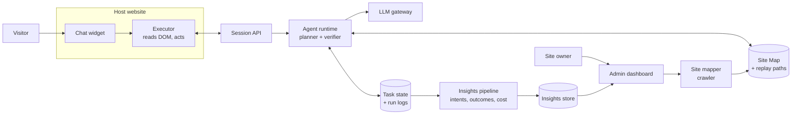
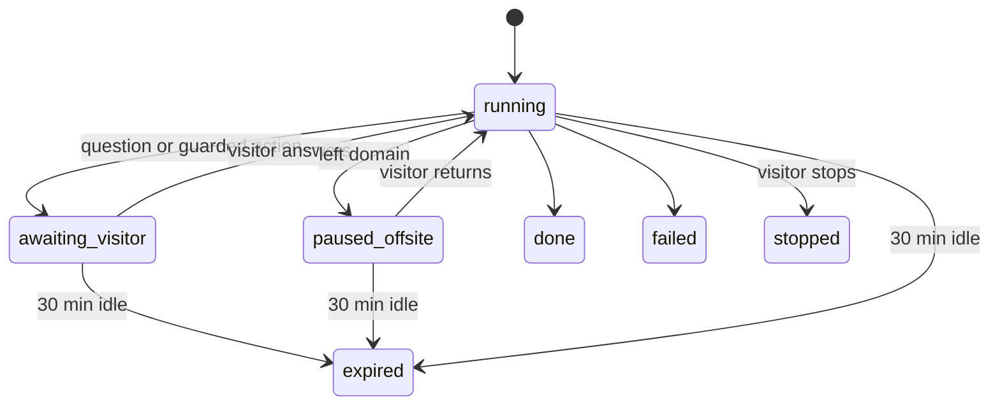

# Site Copilot — Software Requirements Specification

2026-09-19 · @Someone

## 1. Introduction

Site Copilot (working name) is a plugin for websites. The owner adds it the way they would add analytics or a chat widget, and their site gains an AI assistant that operates the site for visitors — plus an admin side that shows the owner exactly how visitors are using it.

### 1.1 Purpose

This SRS defines the requirements for v1, which has two halves that sell each other:

- **The assistant.** An embeddable agent that takes a visitor's instruction in chat and completes it by navigating and operating the website's own UI, inside the visitor's logged-in session.
- **The admin side.** A dashboard where the owner installs, controls and brands the assistant, and sees what visitors ask it, what it completes, what it fails at, and what they wanted that the site cannot yet do.

### 1.2 Product summary and positioning

We are a plugin, not a platform migration. Nothing about the host site changes.

- A site owner installs us in one step: a `<script>` tag, or a one-click install from their CMS or tag manager. No code changes, no APIs to build, no redeploy.
- The assistant is **theirs**. They name it, brand it and set what it may do. Visitors see the owner's assistant, not ours.
- A mapper crawls the site and builds a Site Map of pages, forms and actions. The owner reviews and approves it.
- A visitor types a goal ("book a truck to Mombasa on Friday"). The agent reads the page DOM, plans steps, clicks, types and navigates across pages, and confirms before risky actions.
- The owner opens the admin side and sees every conversation, the top things visitors ask for, where tasks fail, what it costs, and the requests the site could not satisfy.
- Successful runs are saved as replayable paths, so repeat tasks run faster and cheaper.

The install must feel like a plugin (minutes, reversible, no engineer). The admin side is what makes it worth keeping: it turns visitor conversations into a running account of what people actually want from the site.

### 1.3 Assumptions (stated, to be confirmed)

1. The buyer is the site owner, not the end user. The copilot is first-party on their domain.
2. The assistant is white-labelled. The owner's brand is on it; ours is not, beyond a required AI disclosure (FR-57).
3. The agent acts through the UI (DOM), not the site's APIs or source code. Code or API access is a later enhancement.
4. The agent never handles passwords. It only acts inside a session the visitor already has.
5. v1 supports both single-page apps and classic multi-page sites, using server-side task state to survive reloads.
6. v1 works only on the owner's own domain(s). Off-domain steps (payment gateways, external logins) are handed back to the visitor.
7. Usage insight is a primary value driver, not an operations by-product. Owners renew because the admin side tells them something they did not know.

### 1.4 Definitions

| Term | Meaning |
| --- | --- |
| Site owner | Business that installs the copilot on its website |
| Visitor | Person using the website and talking to the copilot |
| Assistant | The owner-branded copilot as visitors see it |
| Site Map | Owner-approved catalogue of pages, forms and actions |
| Task | One visitor goal, from instruction to verified outcome |
| Step | One UI action: click, type, select, navigate, wait, verify |
| Snapshot | Compact description of the page's interactive elements sent to the agent |
| Settle | The page has reached a stable state after an action (see FR-53) |
| Handover | The agent stops and gives control back to the visitor |
| Guarded action | Action marked as risky (pay, delete, submit) that needs visitor confirmation |
| Replay path | Recorded step sequence from a successful task, reused for similar tasks |
| Intent | A cluster of visitor goals that mean the same thing |
| Unmet request | A visitor goal the assistant refused, failed, or found no Site Map coverage for |
| Drift | The live site no longer matches the approved Site Map |

## 2. Overall description

Three actors use the system: the site owner installs, controls and learns from it, the visitor uses it, and the platform operator runs it.

### 2.1 Actors

| Actor | Goals | Main interactions |
| --- | --- | --- |
| Site owner (admin) | Add an assistant without engineering work; keep control of what it can do; understand what visitors want and where the site falls short | Install plugin, run mapper, approve Site Map, set guarded actions, brand the assistant, read conversations, intents, failures and unmet demand, watch cost |
| Visitor | Get tasks done by describing them | Chat, watch the agent act, confirm guarded actions, stop or take over at any time |
| Platform operator (us) | Run the service reliably and cheaply | Monitor runs, manage model costs, handle support |

### 2.2 Operating environment

- Runs in current desktop and mobile browsers (Chrome, Edge, Safari, Firefox; latest two versions).
- Host sites: SPAs (React, Next.js, Vue, Angular) and multi-page sites (WordPress, PHP, server-rendered).
- Install surfaces: raw script tag, WordPress plugin, Shopify app, Wix and Squarespace apps, Google Tag Manager.
- Backend: hosted cloud service with an LLM provider behind a model gateway.

### 2.3 Constraints

- The script only reaches the host page's same-origin DOM. Cross-origin iframes (payment widgets, embedded maps) cannot be operated.
- Some sites set a Content Security Policy that blocks third-party scripts or connections. The owner must allow the script and API domains.
- Each agent step costs a model call, so cost per task must be tracked and bounded.
- CAPTCHAs and bot checks are never solved or bypassed by the agent. They are handed to the visitor.
- The site key travels in the page source and is therefore public. It identifies a site; it does not authenticate one (see FR-56).

## 3. System architecture

A thin client in the browser executes steps, and all planning and task state live on the server, so a task survives page reloads, new tabs and crashes. Everything the agent does is logged, and an insights pipeline turns those logs into what the owner sees.

The executor sends a compact snapshot of the page to the agent runtime, receives one step, performs it, and reports the result.

### 3.1 Components

| Component | Runs in | Responsibility |
| --- | --- | --- |
| Embed script | Browser | Loads widget and executor; identifies site; resumes active task on each page load |
| Chat widget | Browser | Conversation UI, step highlights, confirm and stop controls |
| Executor | Browser | Builds DOM snapshots; performs click, type, select, scroll, navigate, wait; reports results |
| Session API | Server | Issues and validates visitor session tokens; authorises task access; relays snapshots and steps |
| Agent runtime | Server | Plans next step from goal, Site Map, snapshot and history; verifies outcomes; applies guardrails |
| LLM gateway | Server | Model routing, retries, token and cost metering |
| Site mapper | Server | Crawls site (public and owner-authenticated), extracts pages, forms, fields and actions |
| Replay engine | Server | Matches tasks to saved paths; replays deterministically; falls back to the planner on mismatch |
| Insights pipeline | Server | Aggregates run logs into intents, outcomes, funnels, failure hotspots, unmet demand and cost |
| Admin dashboard | Web app | Install, branding, Site Map review, guarded actions, conversations, usage insight, cost |
| Stores | Server | Task state, run logs, Site Maps, replay paths, insights |

### 3.2 Task loop

1. Visitor sends a goal. The server creates a task.
2. Executor sends a DOM snapshot: visible interactive elements with labels, roles and stable selectors.
3. Agent returns one step, or asks the visitor a question.
4. Executor performs the step, waits for the page to settle (FR-53), and reports the new snapshot.
5. Agent verifies the outcome and continues until the goal is met, a guarded action needs confirmation, or the task fails.
6. On navigation, the next page's script resumes the task from server state.
7. Every step and message is written to the run log, which feeds the admin side.

### 3.3 Page understanding

The agent works from DOM snapshots, not screenshots, for speed and cost. Screenshots are a fallback only for elements the DOM cannot describe (canvas, icon-only buttons).

## 4. Functional requirements

Priority: **M** = must have for v1, **S** = should have, **C** = could have later.

### 4.1 Installation and onboarding

| ID | Requirement | Priority |
| --- | --- | --- |
| FR-1 | Owner signs up and gets a site key and a one-line script tag. | M |
| FR-2 | Owner verifies domain ownership (DNS TXT record or meta tag) before the copilot can run. | M |
| FR-3 | Script loads asynchronously and must not block or break the host page if our service is down. | M |
| FR-4 | Owner can restrict the copilot to listed domains and URL paths. | M |
| FR-5 | Owner white-labels the assistant: name, avatar, colour, position, greeting and tone. Visitors see the owner's brand. | M |
| FR-46 | One-click install from WordPress, Shopify, Wix, Squarespace and Google Tag Manager, with the site key applied automatically. | S |
| FR-47 | Guided setup checks the script is live, the domain is verified and the CSP allows our domains, and reports what is missing in plain language. | M |
| FR-48 | Uninstall is one step and leaves no trace on the host site. | M |
| FR-49 | Owner can disable the assistant instantly across all pages from the dashboard, without touching the host site. | M |

### 4.2 Site mapping

| ID | Requirement | Priority |
| --- | --- | --- |
| FR-6 | Mapper crawls public pages and, with an owner-provided test account, logged-in pages. | M |
| FR-7 | For each page, mapper records URL pattern, purpose, forms, fields (label, type, required, options) and actions (buttons, links). | M |
| FR-8 | Mapper proposes guarded actions automatically (submit payment, delete, cancel, send). | M |
| FR-9 | Owner reviews the Site Map: edit descriptions, disable pages or actions, mark or unmark guarded actions. | M |
| FR-10 | Only an approved Site Map is used in production. Re-mapping creates a new version for review. | M |
| FR-11 | Mapper also learns from live runs, proposing new pages or actions for owner approval. | C |
| FR-50 | Crawling is read-only: the mapper never submits forms, confirms dialogs or triggers guarded actions. It respects robots.txt and a configurable crawl rate. | M |
| FR-51 | Drift detection: when live runs stop matching the approved Site Map, the owner is shown which pages or actions changed and is prompted to re-map. | S |

### 4.3 Chat and visitor control

| ID | Requirement | Priority |
| --- | --- | --- |
| FR-12 | Visitor can type a goal in natural language, in English at minimum. | M |
| FR-13 | Agent shows a short plan before acting and narrates each step in one line. | M |
| FR-14 | Agent highlights the element it is about to act on. | M |
| FR-15 | Visitor can stop the task at any time; the agent halts before the next step. | M |
| FR-16 | Agent detects that the visitor changed the page under it and re-plans from the current state. | M |
| FR-17 | Agent asks the visitor for missing information instead of guessing (e.g. which date). | M |
| FR-18 | Agent answers questions about the site from the Site Map without acting. | S |
| FR-19 | Support for additional languages (Swahili, Luganda, French). | C |
| FR-59 | Visitor can hand control back to the agent after taking over, with an explicit "continue" control. | S |

### 4.4 Task execution

| ID | Requirement | Priority |
| --- | --- | --- |
| FR-20 | Executor supports click, type, select, check, scroll, navigate, wait-for-element, read-text. | M |
| FR-21 | Executor handles native inputs and common custom components (custom dropdowns, date pickers, comboboxes), against a documented compatibility matrix. Unrecognised components trigger handover rather than a guess. | M |
| FR-22 | After every step, agent verifies the expected result (element appeared, URL changed, message shown). | M |
| FR-23 | Steps are classed as non-mutating or mutating. Non-mutating steps retry with a different strategy up to 2 times. A mutating step is never retried automatically: the agent re-reads the page to determine whether it succeeded, and hands over if it cannot tell. | M |
| FR-24 | Agent carries data between pages (read a value on page A, use it on page B). | M |
| FR-25 | Agent never fills password, card-number or OTP fields; it asks the visitor to fill them. | M |
| FR-26 | Agent operates only inside the owner's allowed domains and never navigates elsewhere on its own. | M |
| FR-52 | Targets resolve by ordered fallback — role plus accessible name, then visible text, then structural path — and are re-resolved at execute time, never reused from plan time. | M |
| FR-53 | "Settled" is defined and measurable: DOM mutations quiet for a set interval, no pending same-origin requests, and a hard timeout after which the agent re-snapshots and re-plans. | M |
| FR-54 | Executor dispatches framework-native event sequences so React, Vue and Angular controls register input, and traverses the host site's shadow DOM and same-origin iframes. | M |
| FR-55 | When a task fails or is handed over mid-flow, the agent tells the visitor what it already did, in plain language. | M |

### 4.5 Navigation and context

| ID | Requirement | Priority |
| --- | --- | --- |
| FR-27 | Task state (goal, plan, step index, collected data, chat history) is stored server-side, keyed by task and visitor session. | M |
| FR-28 | On every page load, the script checks for an active task, restores the chat and resumes the next step. | M |
| FR-29 | In SPAs, executor detects route changes and waits for new content before continuing. | M |
| FR-30 | When a flow leaves the domain, agent pauses with a message and resumes when the visitor returns. | M |
| FR-31 | A task stays bound to the tab it started in, identified by a per-tab token in sessionStorage; other tabs show it as running elsewhere. Tab duplication is treated as a new tab. | S |
| FR-32 | Idle tasks expire after 30 minutes in any waiting state, including paused off-site. | M |

### 4.6 Guardrails, security and privacy

| ID | Requirement | Priority |
| --- | --- | --- |
| FR-33 | Guarded actions require explicit visitor confirmation showing exactly what will be submitted. | M |
| FR-34 | Agent acts only with the visitor's own session and cannot exceed their permissions. | M |
| FR-35 | Owner can set a maximum number of steps and maximum cost per task. | M |
| FR-36 | Instructions found in page content are treated as data, never as commands to the agent. The agent may only take actions present in the approved Site Map, and this is enforced server-side, not by prompt. A regression suite of injection cases runs on every release. | M |
| FR-37 | Agent refuses tasks outside the site's purpose (as defined by the owner). | S |
| FR-56 | Session API issues a signed, short-lived visitor session token bound at creation; every task read and write is authorised against it. Because the site key is public, it is treated as an identifier only, and requests are rate-limited per session, per IP and per site before any model call. | M |
| FR-57 | On first use, the visitor is told they are talking to an AI assistant and that page content is processed by a third-party model, with a link to the owner's privacy notice. | M |
| FR-58 | Visitors can request deletion of their conversations and task data; owners can action it from the dashboard. | S |

### 4.7 Record and replay

| ID | Requirement | Priority |
| --- | --- | --- |
| FR-38 | Every successful task is saved as a parameterised path (steps with variable inputs). | S |
| FR-39 | New tasks matching a saved path replay it without planner calls, verifying each step. | S |
| FR-40 | On any mismatch during replay, the planner takes over from the current step. | S |
| FR-41 | Owner can view, rename, disable or delete replay paths. | C |
| FR-60 | Path matching uses a defined intent signature with a confidence threshold; below it, the planner runs. A wrong replay must never silently act, so matches are verified step by step against the live page. | S |

### 4.8 Admin dashboard: control and usage insight

The admin side answers one question for the owner: how are visitors using my assistant, and what does that tell me about my site?

**Control**

| ID | Requirement | Priority |
| --- | --- | --- |
| FR-44 | Usage and cost by day, with a monthly spend cap and a warning before it is reached. | M |
| FR-45 | Team access with owner, analyst and viewer roles. | S |
| FR-67 | Conversation content respects field-level masking (NFR-7), and access to it is role-gated and audit-logged. | M |

**What happened**

| ID | Requirement | Priority |
| --- | --- | --- |
| FR-42 | Run log per task: goal, steps, snapshot summary, outcome, cost, duration. | M |
| FR-61 | Conversation explorer: browse and filter every visitor conversation by outcome, date, page, intent and cost, and replay any task step by step as the visitor saw it. | M |
| FR-63 | Free-text search across conversations in the visitor's own words. | S |

**What visitors want**

| ID | Requirement | Priority |
| --- | --- | --- |
| FR-43 | Analytics: tasks started, completed, failed, handed over; top goals; top failure points. | M |
| FR-62 | Visitor goals are clustered into named intents, ranked by volume, each with its success rate, median duration and cost. | S |
| FR-64 | Unmet demand report: goals the assistant refused, failed, or found no Site Map coverage for, grouped and ranked by volume. This is the owner's list of what the site cannot yet do. | M |
| FR-65 | Failure hotspots: which pages, forms and actions tasks die on, and at which step. | M |
| FR-66 | Task funnel with drop-off per stage: started, plan shown, guarded action confirmed, completed. | S |
| FR-68 | Trends over time against a comparison period. | S |
| FR-69 | Site Map coverage: share of visitor intents the approved map can serve. | C |

**Getting it out**

| ID | Requirement | Priority |
| --- | --- | --- |
| FR-70 | Alerts by email or webhook on success-rate drop, cost spike, spend cap approach, and new unmet demand above a threshold. | S |
| FR-71 | Export conversations and aggregates as CSV or JSON, and a read API for the owner's own BI tools. | C |

## 5. Non-functional requirements

The targets below are initial proposals for v1 and should be tuned after the first pilot.

| ID | Area | Requirement |
| --- | --- | --- |
| NFR-1 | Page impact | Loader under 15 KB gzipped; widget and executor under 50 KB gzipped, lazy-loaded after first paint; adds no more than 100 ms to page interactive time when no task is active. |
| NFR-2 | Step latency | Median time per planned step under 3 s and p95 under 6 s; replayed steps under 1 s. |
| NFR-3 | Task success | At least 85% of in-scope tasks complete without handover, measured against a fixed scripted task suite per pilot site. Off-domain handovers and out-of-scope refusals (FR-37) are reported separately and excluded from the denominator. |
| NFR-4 | Availability | Backend 99.5% monthly; if unavailable, the widget hides and the site works normally. |
| NFR-5 | Isolation | Widget renders in a shadow DOM so host CSS and our CSS never affect each other. |
| NFR-6 | Security | All traffic over TLS; site keys scoped to verified domains; per-site, per-visitor and per-IP rate limits. |
| NFR-7 | Privacy | DOM snapshots mask password, card, OTP and owner-marked sensitive fields before leaving the browser, failing closed when a field's type is uncertain. |
| NFR-8 | Data retention | Run logs kept 30 days by default, configurable by owner; snapshots stored only in redacted form. Aggregated insights are retained for 13 months so trends survive log expiry. |
| NFR-9 | Compliance | Data processing terms for owners; alignment with Uganda's Data Protection and Privacy Act 2019, GDPR for EU visitors, and EU AI Act transparency obligations. |
| NFR-10 | Cost | Cost per task metered and capped per FR-35. Target average under USD 0.25 per completed task before replay — the v1 gate, since FR-38 to FR-40 are priority S — and under USD 0.05 once replay covers the site's top intents. |
| NFR-11 | Accessibility | Widget meets WCAG 2.1 AA (keyboard use, screen-reader labels, contrast). |
| NFR-12 | Browser support | Latest two versions of Chrome, Edge, Safari, Firefox; mobile Chrome and Safari. |
| NFR-13 | Observability | Every step logged with task id, timing, model tokens and outcome for debugging. |
| NFR-14 | Runtime footprint | Snapshots are bounded in size and element count; executor work during a task must not make the host page visibly janky. |
| NFR-15 | Agent accessibility | Agent actions manage focus predictably and announce each step through a live region, so screen-reader users can follow what is happening. |
| NFR-16 | Insight freshness | Conversations appear in the admin side within 1 minute; aggregates refresh at least hourly. |
| NFR-17 | Sub-processors | The LLM provider is contracted for zero retention and no training on customer data, and is disclosed to owners in the DPA. |

## 6. Data model

Every entity hangs off a Site, and every Site hangs off an Account.

| Entity | Key fields | Notes |
| --- | --- | --- |
| Account | id, name, plan, spend\_cap, created\_at | Billing and team boundary |
| User | id, account\_id, email, role (owner, analyst, viewer) | Supports FR-45 and FR-67 |
| Site | id, account\_id, domains\[\], site\_key, verification (method, status), settings (branding, limits, allowed paths), enabled | One per installed website; `enabled` backs the FR-49 kill switch |
| SiteMapVersion | id, site\_id, version, status (draft, approved), created\_at | Only one approved version is live |
| PageDef | id, map\_version\_id, url\_pattern, purpose, forms\[\], actions\[\] | Field: label, type, required, options, selector hints, sensitive flag. Action: label, kind, guarded flag |
| Task | id, site\_id, visitor\_session\_id, tab\_token, goal, plan, step\_index, collected\_data, status, intent\_id, cost, timestamps | Status: running, awaiting\_visitor, paused\_offsite, done, failed, stopped, expired |
| Step | id, task\_id, index, action, target, input, mutating, result, verified, duration\_ms, tokens, cost | Per-step cost lets FR-35 halt mid-task. Snapshots stored redacted only |
| Message | id, task\_id, role (visitor, agent, system), text, created\_at | Chat history restored on each page load |
| ReplayPath | id, site\_id, intent\_signature, params\[\], steps\[\], success\_count, fail\_count, enabled | Built from successful tasks |
| Intent | id, site\_id, label, signature, task\_count, success\_rate, covered | Clusters visitor goals for FR-62; `covered` false feeds the FR-64 unmet demand report |

The diagram shows the Task status lifecycle referenced in FR-15, FR-30 and FR-32.

## 7. Out of scope for v1

- Logging in on the visitor's behalf or storing any visitor credentials.
- Solving CAPTCHAs or bypassing bot protection.
- Operating cross-origin iframes, including payment widgets.
- Acting on third-party websites the owner does not control (end-user browser-agent product).
- Reading source code or calling site APIs directly (planned hybrid mode, later).
- Voice input and output.
- Native mobile apps; v1 is web only.
- Scheduled or background tasks that run without the visitor present.
- Acting on the insights automatically. v1 reports unmet demand; it does not build the missing flows.

## 8. MVP milestones

Milestone 5 is the core product claim: it works on a site we did not build, with no code changes. Milestone 0 exists to test that claim before anything is built on top of it.

| # | Milestone | Verify |
| --- | --- | --- |
| 0 | External reality spike | Executor runs read-only against 5 sites we did not build; measure what share of interactive elements can be described and re-targeted after reload. De-risks FR-21 and FR-52 before build |
| 1 | Script tag + widget on one of our own sites | Widget loads on every page; host page speed and layout unchanged; site still works with our backend off; kill switch hides it instantly |
| 2 | Single-page task from chat | Agent completes one form from an instruction; a real record is created; guarded submit asks for confirmation |
| 3 | Multi-page task with server-side state | A booking flow across 3+ pages completes; survives full reloads (MPA) and route changes (SPA); stop works mid-task |
| 4 | Site mapper + owner review | Mapper produces a Site Map for the pilot site without side effects; owner edits and approves it; agent uses only approved actions |
| 5 | Install on a site we did not build | Milestone 3 flow passes on an external site with zero code changes beyond the script tag |
| 6 | Admin side: conversations, insight, cost caps | Owner can read any conversation step by step, see top intents, failure hotspots and unmet demand, and a cost cap halts a task when exceeded |
| 7 | Security and privacy gate | Session token authorisation, rate limiting, field masking and the prompt-injection suite all pass before real visitors use an external site |
| 8 | Record and replay | A repeated task replays with no planner calls; a deliberate UI change triggers fallback and still completes |

Pilot target: 3 external sites, 50 real tasks each, measured against NFR-2, NFR-3 and NFR-10. Task suites are scripted for the NFR-3 measurement and separated from organic visitor traffic.

## 9. Open questions

These decisions change scope or architecture and should be settled before build starts.

- [ ] Product name and which company it sits under.
- [ ] Confirm buyer: site owner only for v1, or also an end-user browser extension later?
- [ ] First pilot sites: which of our own platforms goes first, and which 3 external sites?
- [ ] Launch order for site types: SPAs first, multi-page first, or both from day one (as assumed here)?
- [ ] Which install surface after the raw script tag — WordPress, Shopify or GTM first?
- [ ] LLM provider and model per role (planner vs verifier vs mapper), and whether self-hosted models are needed for data-sensitive clients.
- [ ] Hosting region and data residency requirements for government and enterprise clients.
- [ ] Pricing model: per completed task, per active visitor, or flat tier with task caps. Is the admin side included or a paid upgrade?
- [ ] Who writes the visitor-facing AI disclosure — us in the widget, or the owner in their privacy policy?
- [ ] Liability when the agent acts wrongly (books twice, wrong item): what does the owner contract say, and what is the default guarded-action set?
- [ ] Tech stack for backend and dashboard.
- [ ] Is hybrid mode (API or code access alongside the UI) a v2 goal or a separate product?
